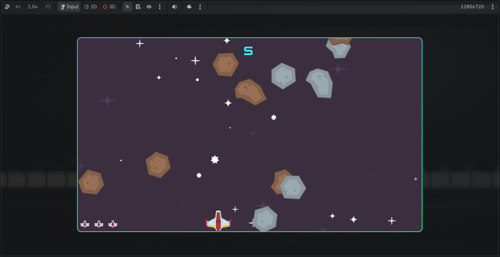
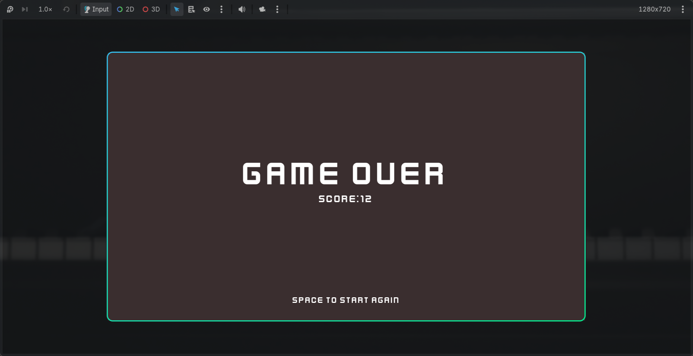

# Space Shooter


## Description

A simple 2D space shooter game built with **Godot Engine**. Control your spaceship, dodge and destroy meteors to survive and achieve the highest score possible.

---

## Features

- Smooth spaceship movement
- Projectile shooting
- Collision detection
- Score tracking

---

## Preview

| Gameplay | Combat |
|----------|--------|
|  |  |

---

## Built With

- **Godot Engine**
- **GDScript**

---

## Getting Started

1. Clone the repository:

```bash
git clone https://github.com/your-username/space-shooter.git
```

2. Open the project in **Godot**.

3. Press **F5** (Run Project) to start the game.

---

## Project Structure

```
SpaceShooter/
├── assets/
├── scenes/
├── scripts/
├── images/
└── project.godot
```

---

## Asset Credits

Game assets were created by **Kenney**.

- https://www.kenney.nl

Thank you to Kenney for providing high-quality free game assets.
